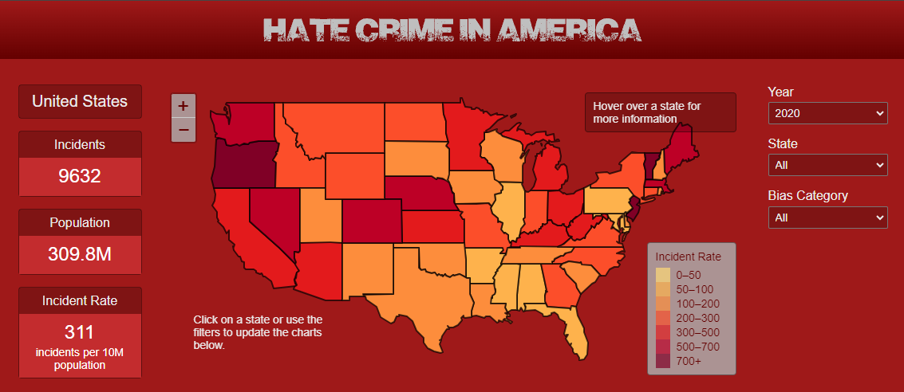
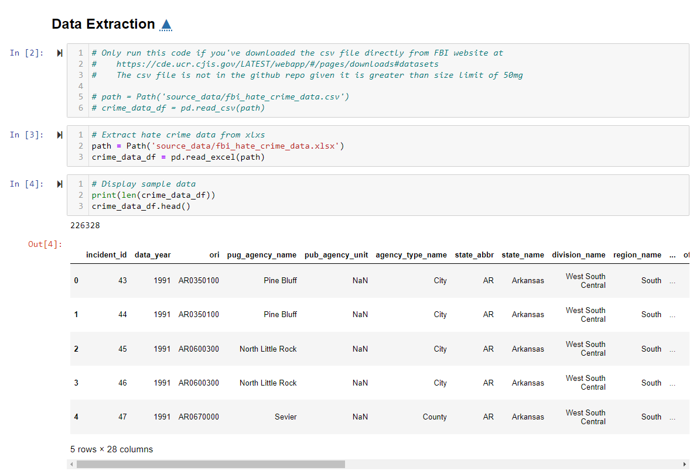
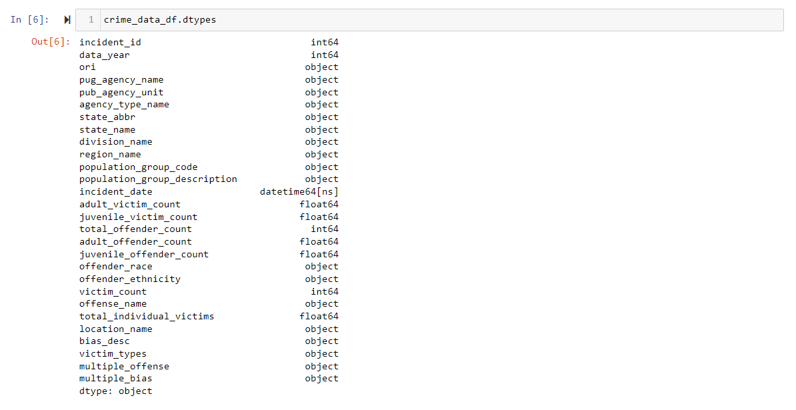
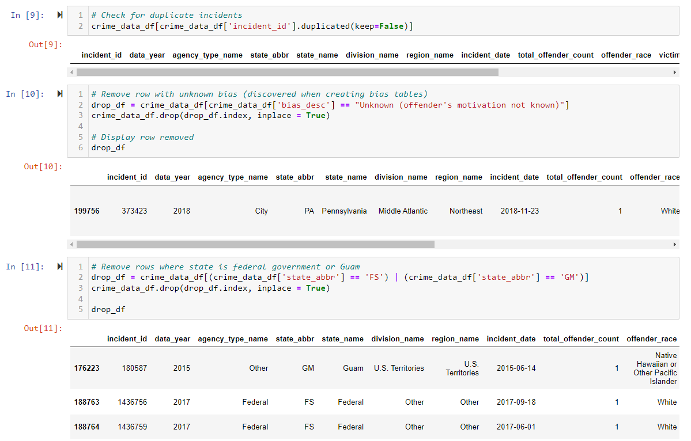
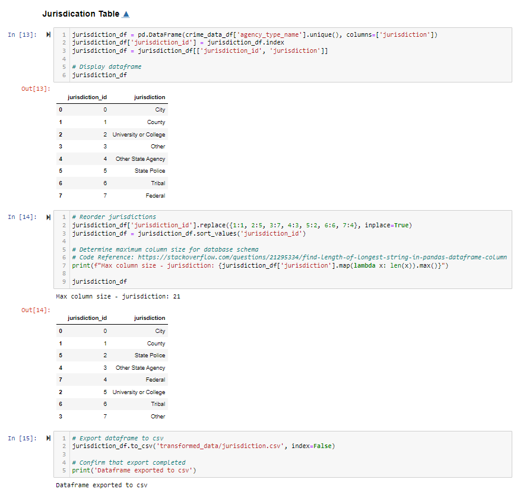
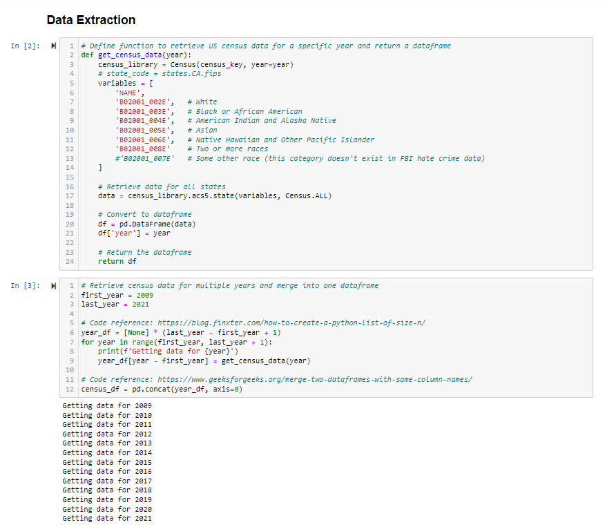
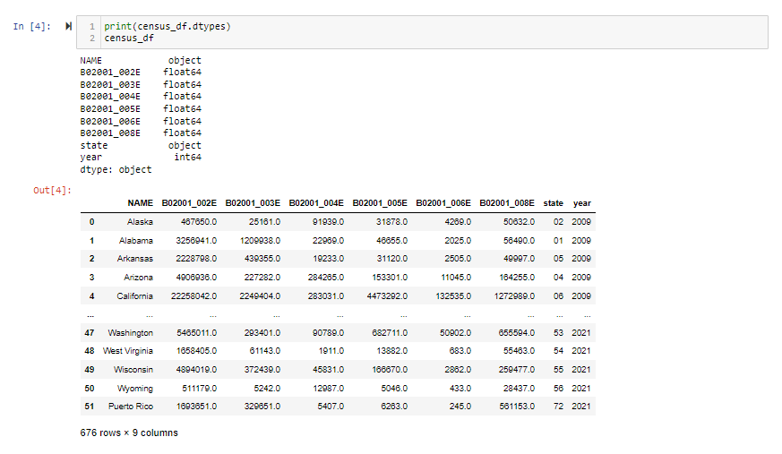
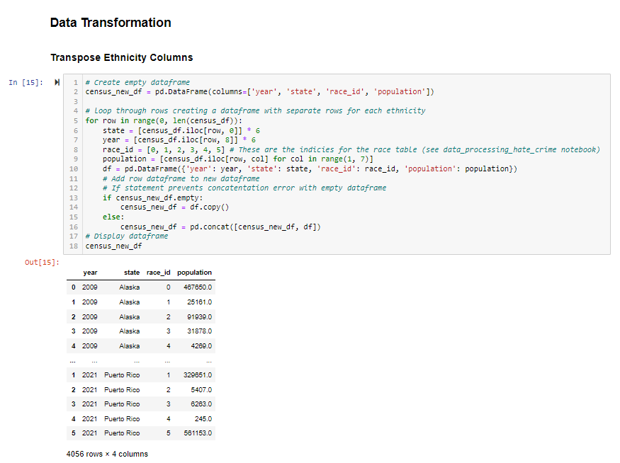
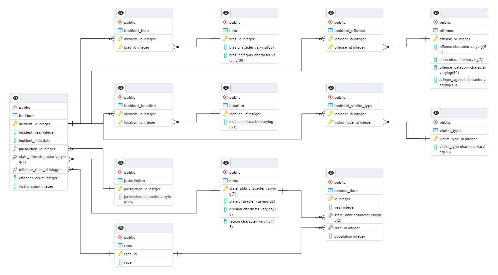

# Project: Hate Crime in America

An interactive web application to investigate hate crime in America between 2009 and 2020 exploring trends by year, state, offender bias, and the offense committed.

## Table of Contents

* [Overview](#overview)
    * [Project Description](#project-description)
    * [Project Requirements](#project-requirements)
* [Installation and Setup](#installation-and-setup)
    * [Software Requirements](#software-requirements)
    * [General Instructions](#general-instructions)
    * [PostgreSQL Database Instructions](#postgresql-database-instructions)
* [Data](#data)
    * [Sources](#sources)
    * [Aquisition](#acquisition)
    * [Processing](#processing)
* [Database Structure](#database-structure)
    * [ERD](#erd)
    * [Schema](#schema)
* [Web Application](#web-application)
* [Repository Structure](#repository-structure)
* [Results and Evaluation](#results-and-evaluation)
* [Future Work](#future-work)
* [Acknowledgements/References](#acknowledgements/references)
* [License](#license)

## Overview

### Project Description

The purpose of this project was to redesign and improve an interactive web application developed for a group assignment at UC Berkeley's Data Analytics Boot Camp (2023). Improvements to the application included an interactive map and information panel, cleaner layout and appearance, simplified database structure, and the option to use an SQLite database instead of creating a postgreSQL database.

### Project Requirements

1. Visualization must include a Python Flask-powered API, HTML/CSS, JavaScript, and at least one database (SQL, MongoDB, SQLite, etc.).
2. The project should fall into one of the following tracks:
    * Combination of web scraping and Leaflet or Ploty.
    * Dashboard page with mutliple charts that update from the same data.
    * "Thick" server that performs multiple manipulations on data in a database prior to visualization.
3. Project must include at least one new JavaScript Library.
4. Project must be powered by a dataset with at least 100 records.
5. Project must include some level of user-driven interaction, such as menus, dropdowns, and textboxes.
6. Final visualization should include at least 3 views.

## Installation and Setup

The following software requirements and instructions were developed and have only been tested on a Windows 11 computer.

### Software Requirements
* Editors: VS Code 1.86 and Jupyter Notebook 6.5.4
* Python Version: 3.10.13
* Python Packages: requests, pathlib, pandas, census, sqlalchemy, flask
* PostgreSQL Version: 15 (installation includes pgAdmin)
Note: PostgreSQL software is not needed if using the SQLite database.

### General Instructions
1. Verify the above software requirements and dependencies have been meet on your computer.
2. Clone this repository.
3. If creating a postgreSQL database, edit the [config_blank.py](config_blank.py) file and update the variables with your postgreSQL database information.
    ```
    db_username = '[username]' # Default in pgAdmin is postgres
    db_password = '[your password]'
    b_host = 'localhost'
    db_port = 5432
    db_name = '[name of your database]'
    ```
4. If using the existing SQLite database, edit the [config_blank.py](config_blank.py) file and set the flag to false.
    ```
    postgreSQL_flag = False.
    ```
5. After updating and saving config_blank.py, rename it to config.py.

6. If you will be extracting census information using the [data_processing_hate_crime.ipynb](database/data_processing_hate_crime.ipynb) notebook, edit the [census_config_blank.py](database/census_config_blank.py) file in the database directory and update the variable with your API key. 
    ```
    census_key = '[your API key]'
    ```
    You can get an API key at  https://api.census.gov/data/key_signup.html.
7. After updating and saving config_blank.py, rename it to config.py.
8. Open a terminal and start the application.
    ```
    python app.py
    ```
    If you are using a postgreSQL database and get a connection refused error message or a failure to connect to the server message, make sure postgreSQL is installed properly and the windows service is running.
9. Open your Internet browser and go to http://127.0.0.1:5000.
10. To stop the application, press CTRL+C in your terminal and close the browser tab.

# Need to redo section below!!!
### PostgreSQL Database Instructions
These instructions assume you have installed and are familiar with postgreSQL and pgAdmin.
1. Open pgAdmin and create a database.
2. Use the Query Tool to open the file [hate_crime_schema.sql](database/schema-erd/hate_crime_schema.sql). 
3. Highlight and run the code for each table and view. 
4. Right click on each table on the panel and import the corresponding csv file stored in the [database/transformed_data directory](database/transformed_data). Important: Import the files in the order that the tables were created to avoid errors due to foreign key constraints.

### Application Usage
1. Follow installation instructions above.
2. Naviate to the project directory and execute the following command.
    ```
    python app.py
    ```
3. Once the application has connected to the database and is running, go the the URL listed for the development server. This is typically http://127.0.0.1:5000/.

## Data

### Sources
* FBI Hate Crime Data: https://cde.ucr.cjis.gov/LATEST/webapp/#/pages/downloads#datasets
* FBI NIBRS Group A Offenses: https://le.fbi.gov/file-repository/nibrs-technical-specification-063023.pdf/view
* US Census Bureau Bike Commuting Data (2022 ACS5 Table S0802): https://data.census.gov/table/ACSST5Y2022.S0802?q=commuting

### Acquisition

* FBI Hate Crime Data: This only available as a csv file and was downloaded using the URL above.
* FBI NIBRS Group A Offenses: This was only available in the linked pdf above. The data was copied from a table in Appendix A on page 212, pasted into an Excel spreadsheet and then saved as a CSV file.
* US Census Bureau Data: The URL above helped identify the field names needed to import the data into a pandas dataframe using the <a href="https://pypi.org/project/census/" target="_blank">census python package</a>.

### Processing

The data was extracted from from the sources above and transformed to load into a database. The FBI data was processed using Python in a [Jupyter notebook](database/data_processing_us_census.ipynb) as follows:
1. Hate crime data was extracted from a csv or xlsx file and columns reviewed.

    
    

2. Data was cleaned removing unneeded rows and columns and columns with missing data (example below).

    

3. Data was normalized and a dataframe was created for each database table and exported to a csv (see example below).

    

The US Census Bureau data was processed using Python in a [Jupyter notebook](database/data_processing_hate_crime.ipynb) as follows:
1. Population data for each year was extracted and reviewed.

    
    

2. Data was transformed by transposing ethnicity columns, adding state abbreviations, and changing the data type for one column. (see transposition of ethnicity columns below).

    

## Database Structure

### ERD

The following Entity Relationship Diagram (ERD) was created using pgAdmin.



Something about normalization

### Schema

## API Documentation


## Repository Structure

This repository is organized into the following folders:
* [database](database) - python code for data processing and sqlite database creation as well as the resulting sqlite database
* [database/schema-erd](database/schema-erd) - sql code to create PostgreSQL database and ERD diagram
* [database/source_data](database/source_data) - FBI source data
* [database/transformed_data](database/transformed_data) - csv files for database tables
* [images](images) - image files for this README
* [resources](resources) - documentation and technical specification for hate crime reporting and data collection
* [static](static) - folders for css, javascript, and images for dashboard
* [templates](templates) - dashboard home page
* [testing](testing) - sql and python code used during testing and development 
* root directory - application code, configuration files, licenses and this readme.

## Results and Evaluation


### Evaluation

Limitations
There were several challenges in this project:
1. FBI Hate Crime Dataset - Several fields in the dataset (offense, bias, location, victim type) contained multiple values in one record. These were distiguished as separate records during extraction and transformation but resulted in a complex schema and normalized PostgreSQL database. The dataset also did not include information regarding the city or state where the hate crime was committed. It did include information regarding the reporting agency which included the state and in some cases the city as the name or unit of the agency. The dashboards were based on this state field and it's very possible that some of the incidents occurred in a different state from the reporting agency. This was not noted in any documentation on the FBI site.

3. PostgreSQL Database - As stated above, the normalized PostgreSQL database was complex and contained many tables and relationships. The process of extracting and transforming the data into csv files to create the database was time-consuming and delayed the creation of the flask apps and dashboards. As a result, some of the flask apps were based on a table that mirrored the initial hate critme dataset with multiple values in one record. In hindsight, it may have been more effective to use MongoDB or simplify the database schema.
4. Database and Website Hosting - The advantage of using a hosting service (Render) was the ability for everyone to use the same database and test the code and html using the same service, rather than doing this locally. The challenge in this was learning how to publish the database and website for Render and then discovering the limitations of their free plan, specifically the reliability of remote connections when the hosted server spun down due to inactivity. Although a final published site is up and running, local testing was most effective.
5. Github - The group is still learning Github and the best way to effectively manage and merge code. Juypter notebooks for data cleaning were not integrated and some code in the app.py and app.js needed to be manually updated in the main branch due to merging issues.
6. Project Management - As with Github, the group is still learning how best to divide up work and adequately estimate the time needed for that work. This created delays and impacted the final product. The dashboard was created the last two days of the project and did not include several planned interactive charts and information. 

## Future Work

* Ability to filter by region and 
* Map use static map via D3 and place Alaska and Hawaii to below and to the left of the US.

## Acknowledgments/References

This project was based on a group assignment I completed as part of [UC Berkeley's Data Analyst Boot Camp](https://bootcamp.berkeley.edu/data/data). Although I rewrote the code, modified the database schema, and redesigned the dashboard, I'd like to thank the following group members for their work and inspirations throughout the [original project](https://github.com/evacs/Project-3): Matt Calvert, Ahn-Tu Pham, Eva Schmidt, John Shridhik and Tenzin Zenor.

I'd also like to acknowledge the following resources:
*  FBI Uniform Crime Reporting (UCR) Program - This program aggregates all hate crime offenses reported by law enforcement agencies and maintains data collection guidelines, training materials and annual updates to their methodology. This information was critical to understanding and evaluating the hate crime data.
*  FBI National Incident-Based Reporting System (NIBRS) - This system was created to improve the overall quality of crime data collected by law enforcement. They maintain and update technical specifications for reporting that included categorical information and codes for all group A offenses.  

## License

This project is licensed under the [MIT license](LICENSE.txt).