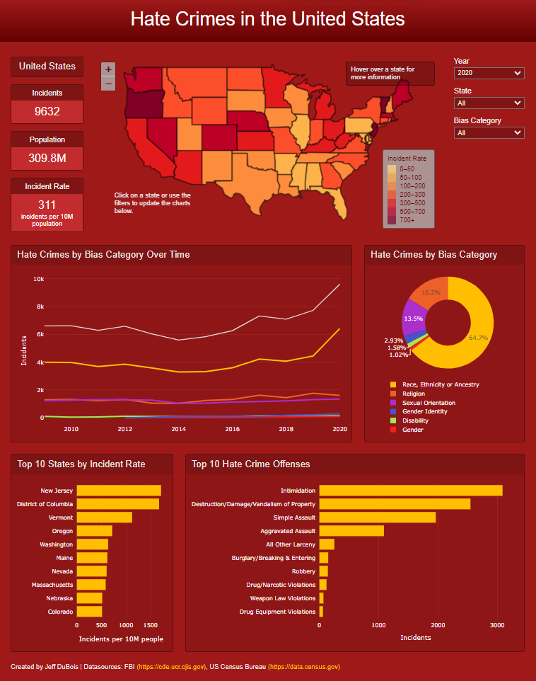
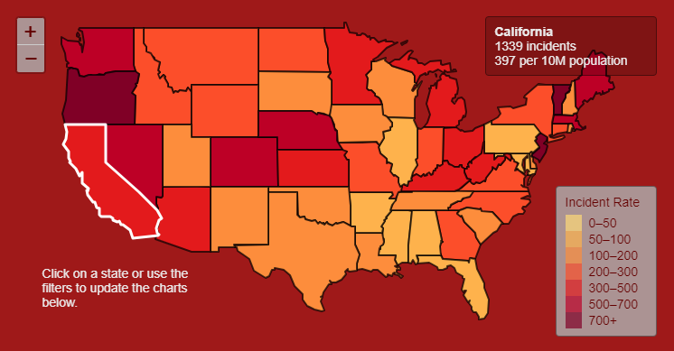
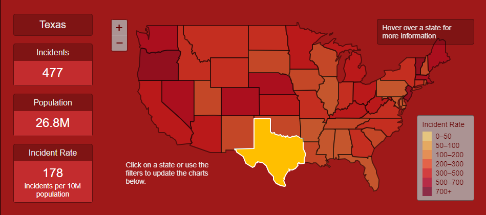
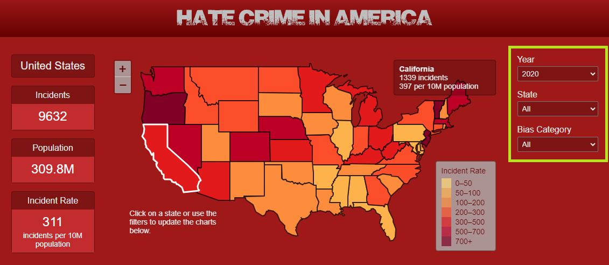

# Project: Hate Crime in America

An interactive web application to investigate hate crime in America between 2009 and 2020 exploring trends by year, state, offender bias, and the offense committed.

## Table of Contents

* [Overview](#overview)
    * [Project Description](#project-description)
    * [Project Requirements](#project-requirements)
* [Installation and Setup](#installation-and-setup)
    * [Software Requirements](#software-requirements)
    * [General Instructions](#general-instructions)
    * [Database Setup](#database-setup)
    * [Application Usage](#application-usage)
* [Data](#data)
    * [Sources](#sources)
    * [Aquisition](#acquisition)
    * [Processing](#processing)
* [Database Structure](#database-structure)
* [Web Application](#web-application)
* [Repository Structure](#repository-structure)
* [Project Evaluation](#project-evaluation)
* [Future Work](#future-work)
* [Acknowledgements/References](#acknowledgements/references)
* [License](#license)

## Overview

### Project Description

The purpose of this project was to redesign and improve an interactive web application developed for a group assignment at UC Berkeley's Data Analytics Boot Camp (2023). Improvements to the application included an interactive map and information panel, cleaner layout and appearance, simplified database structure, and the option to use an SQLite database instead of creating a postgreSQL database.

### Project Requirements

1. Visualization must include a Python Flask-powered API, HTML/CSS, JavaScript, and at least one database (SQL, MongoDB, SQLite, etc.).
2. The project should fall into one of the following tracks:
    * Combination of web scraping and Leaflet or Ploty.
    * Dashboard page with mutliple charts that update from the same data.
    * "Thick" server that performs multiple manipulations on data in a database prior to visualization.
3. Project must include at least one new JavaScript Library.
4. Project must be powered by a dataset with at least 100 records.
5. Project must include some level of user-driven interaction, such as menus, dropdowns, and textboxes.
6. Final visualization should include at least 3 views.

[Back to Table of Contents](#table-of-contents)

## Installation and Setup

The following software requirements and instructions were developed and have only been tested on a Windows 11 computer.

### Software Requirements
* Editors: VS Code 1.86 and Jupyter Notebook 6.5.4
* Python Version: 3.10.13
* Python Packages: requests, pathlib, pandas, census, sqlalchemy, flask
* PostgreSQL Version: 15 (installation includes pgAdmin)
Note: PostgreSQL software is not needed if using the SQLite database.

### General Instructions
1. Verify the above software requirements and dependencies have been met on your computer.
2. Clone this repository.
3. Edit the [config_blank.py](app/config_blank.py) file in the app folder.
    * If using a PostgreSQL database, update the following variables with your postgreSQL database information.

        ```
        db_username = 'postgres' # Change this if you've created a different user
        db_password = '[your password]'
        db_host = 'localhost' # Change this if you're accessing a hosted database
        db_port = 5432
        db_name = '[name of your database]'
        db_options = '' # Use this variable to store any options needed to connect to a hosted database
        ```
 
    * If using the existing SQLite database, set the flag to false.
        ```
        postgreSQL_flag = False
        ```

    * If you will be extracting census information using the [data_processing_us_census.ipynb](data/data_processing_us_census.ipynb) notebook, update the variable with your API key. 
        ```
        census_key = '[your API key]'
        ```
        You can get an API key at  https://api.census.gov/data/key_signup.html.

4. After updating, saving and closing the config_blank.py, rename it to config.py.

### Database Setup
The instructions below use SQLalchemy to setup a PostgreSQL database. The SQLite database (database/us_hate_crimes_sqlite.db) is included in this repository and does not require any setup or additional software to use. If you would like to recreate the SQLite database, use the file [db_creation_sqlite.ipynb](database/db_creation_sqlite.ipynb). 
1. Verify that PostgreSQL is installed and the windows service is running. 
2. Open a terminal window in the database directory and start Jupyter Notebook.
    ```
    jupyter notebook
    ```
3. From Jupyter notebook, open the file [db_creation_postgresql.ipynb](database/db_creation_postgresql.ipynb).
4. Run each cell in order to create the database and load data into all of the tables. Note there is section if you need to delete all data in the database or want to verify that the data was loaded.  

### Application Usage
1. Follow the installation instructions above.
2. Open a terminal in the root directory and change to the app directory.
    ```
    cd app
    ```
3. Start the application.
    ```
    python app.py
    ```
    If you are using a PostgreSQL database and get a connection refused error message or a failure to connect to the server message, make sure PostgreSQL is installed properly and the windows service is running.
4. Open your Internet browser and go to http://127.0.0.1:5000.

    

5. Hover over a state with your mouse to view the number of incidents and incident rate for that state.

    

6. Click on state to update the panel information to the left of the map and all charts to reflect that state.

    

7. Use the dropdown menus on the right to filter the data for the panel information and charts.

     

    Note the following charts will not be changed depending on the filter selected:
    * Hate Crimes by Bias Category Over Time - Not changed by the Year and Bias Category dropdown.
    * Hate Crimes by Bias Category - Not changed by the Bias Category dropdown.
    * Top 10 States by Incident Rate - Not changed by the State dropdown.

8. To stop the application, press CTRL+C in your terminal and close the browser tab.

[Back to Table of Contents](#table-of-contents)

## Data

### Sources
* FBI Hate Crime Data: https://cde.ucr.cjis.gov/LATEST/webapp/#/pages/downloads#datasets
* FBI NIBRS Group A Offenses: https://le.fbi.gov/file-repository/nibrs-technical-specification-063023.pdf/view ()
* US Census Bureau Bike Commuting Data (2022 ACS5 Table S0802): https://data.census.gov/table/ACSST5Y2022.S0802?q=commuting

### Acquisition

* FBI Hate Crime Data: This only available as a csv file and was downloaded using the URL above.
* FBI NIBRS Group A Offenses: This was only available in the linked pdf above. The data was copied from a table in Appendix A on page 212, pasted into an Excel spreadsheet and then saved as a CSV file.
* US Census Bureau Data: The URL above helped identify the field names needed to import the data into a pandas dataframe using the <a href="https://pypi.org/project/census/" target="_blank">census python package</a>.

### Processing

The data was extracted from from the sources above and transformed to load into a database. The FBI data was processed using Python in a [Jupyter notebook](data/data_processing_us_census.ipynb) as follows:
1. Hate crime data was extracted from a csv or xlsx file and columns reviewed.

    
    

2. Data was cleaned removing unneeded rows and columns and columns with missing data (example below).

    

3. Data was normalized and a dataframe was created for each database table and exported to a csv (see example below).

    

The US Census Bureau data was processed using Python in a [Jupyter notebook](data/data_processing_hate_crime.ipynb) as follows:
1. Population data for each year was extracted and reviewed.

    
    

2. Data was transformed by transposing ethnicity columns, adding state abbreviations, and changing the data type for one column. (see transposition of ethnicity columns below).

    

## Database Structure

The following Entity Relationship Diagram (ERD) visualizes the entities, attributes and relationships in the database.


A few notes regarding the overall structure:
* For simplicity and ease of querying the database, some tables were not fully normalized (3NF), specifically the bias, offense, and state tables.
* Three views were created (see [db_schema_views.sql](database/schema_erd/db_schema_views.sql)) to simplify the SQLalchemy queries in the flask app and improve performance.

## API Documentation

The API uses the following endpoints:

* ```/api/lists``` - Retrieves option lists for the Year, State, and Bias Category dropdowns.
* ```/api/biasdata/<state>``` - Retrieves incident information for a specific state.
* ```/api/ratedata/<year>/<bias_category>``` - Retrieves incident rate information for a specific year and bias category.
* ```/api/offensedata/<year>/<state>/<bias_category>``` - Retrieves offense information for a specific year, state and bias category. 

Note: Use 'All' for any of the paramters to get information for all options for that parameter. Example: ```/api/offensedata/2019/California/All```   

[Back to Table of Contents](#table-of-contents)

## Repository Structure

This repository is organized into the following folders:
* [app](app) - python code for web application
    * [app/static](app/static) - folders for css, javascript, and images for dashboard
    * [app/templates](app/templates) - dashboard home page
* [data](data) - python code for processing hate crime and census data
    * [data/source_data](data/source_data) - spreadsheet with FBI data
    * [data/transformed_data](data/transformed_data) - csv files for database tables
* [database](database) - SQLite database and python code for creating PostgreSQL and SQLite databases from processed data in csv files
    * [database/schema_erd](database/schema_erd) - sql code to create PostgreSQL database and ERD diagram
* [images](images) - image files for this README
* [resources](resources) - documentation and technical specification for hate crime reporting and data collection
* [testing](testing) - sql and python code used during testing and development
* [root](/) - license, python requirements and this readme.

[Back to Table of Contents](#table-of-contents)

## Project Evaluation

Overall, this project was a personal success as it greatly expanded my knowledge, troubleshooting skills, and experience in coding, database development, and web visualizations. The resulting product improved upon the original group project in the following areas:

* Data Processing
    * Multiple notebooks for processing hate crimes data were combined to centralize code and simplify steps for processing.
    * Hate crimes code was rewritten for clarity, consistency and to reflect changes in the database structure. Code was also added for further cleaning and validation.
    * US Census code was modified to exclude population totals for all races and add population totals for other races.
    * Markdown was added in large notebooks to easily navigate sections, note code contributions, and further comment code.
* Database Structure
    * The following tables were removed: agencies, agency_oris, agency_units, population_groups, and ethnicity. The agencies in the hate crime data represented a mix of reporting agencies (local police, FBI, universities) as well as cities and municipalities. Given the wide range and limitations of this data, the related tables were not used in the original project. Similarly the population_group was based on the agency_type. The ethnicity table was omitted as the race table could be easily mapped to the census data.
    * Additional fields (offense category, code, and type of crime against society) were added to the offense table. The source data was found as part of this project.
    * Three views were added in the database to simplify SQLalchemy queries in the application and improve performance.
* Database Creation
    * Python code was added to create and load a PostgreSQL database using SQLalchemy and SQL code files. The original project required pgAdmin to execute SQL commands from a file and then import the csv files manually.
    * Python code was added to create and use a SQLite database in addition to a PostgreSQL database.
* Application Dashboard
    * An interactive US map was added to visualize the hate crime incident rates and select a state to filter data in other visuals by that state.
    * A informational visual with total incidents, population and incident rate was added.
    * Centralized dropdown menus for year, state and bias category were added to easily filter all visuals.
    * Hate crimes over time chart and hate crimes by bias category charts were combined into one chart.
    * A pie chart of hate crimes by bias category was added.
    * Layout and formatting of charts was redesigned for consistency, ease of use, and a cleaner overall appearance.
* Application Code
    * Python code was modified to enable using either the PostgreSQL or SQLite database.
    * All flask routes were rewritten to pass values from the dashboard filters as parameters and utlize shared code for consistency and efficiency.
    * Javascript code was added for interactive map, informational visual, and pie chart.
    * Javascript code was rewritten to utlize centralized filters, changes in visuals, and new flask routes. Additional functions were added to streamline and simplify code.
    * CCS sheet was created for the new layout and formatting.
    * HTML was modified for the new visuals, layout and formatting.
* Repository Structure
    * Application code was centralized in one folder.
    * Data processing and database creation files and code were split into separate folders.
    * This markdown file was created to fully document the project.

There were also the following challenges and limitations in the project:
* FBI Hate Crime Dataset - Several fields in the dataset (offense, bias, location, victim type) contained multiple values in one record. These were distiguished as separate records during extraction and required significant transformation to normalize the database. The dataset also did not include information regarding the city and state where the hate crime was committed. It did include information regarding the reporting agency which included the state and in some cases the city as the name or unit of the agency. The dashboards were based on this state field and it's very possible that some of the incidents occurred in a different state from the reporting agency. This was not noted in any documentation on the FBI website.
* Normalized Database - A normalized database is faster and smaller but does result in many tables and relationships which then require more complex queries to obtain data for the visuals. This was compounded by multiple dropdowns to filter data. As a result, the number of visuals was limited and some data (e.g. location, victime type, viction counts, offender race, offender counts, population by race, jurisdiction) was not utilized in a visual.
* SQLite Database - The python code used Pandas to export dataframes to the database. This functionality cannot create primary and foreign keys and by default will automatically define the datatype for each field/attribute. This was chosen for expediency as the application was initially designed to use a PostgreSQL database.
* Additional Tools and Knowledge - It cannot be ignored that I still have much to learn and there are many tools I have not yet used that could have improved the functionality and functioning of the application. I explored some new tools but need further study and practice to leverage them in future projects.

[Back to Table of Contents](#table-of-contents)

## Future Work

Some recommended areas of future work on this application include:
* Additional Pages/Visuals - Create a navigation pane/menu and add addtional pages with visuals based on currently unused data (e.g. location, victim type, viction counts, offender race, offender counts, population by race, jurisdiction). Also create a summary page with summary data and trends (% increase in incidents from 2009 to 2021).
* Interactive Map - Use a static map (such as D3) instead of Leaflet which cannot easily illustrate Alaska and Hawaii below and to the left of the US. Currently, it is easiest to use the dropdown filter to select those states.
* Filters - Add a filter by region and/or division. This would provide valuable information regarding incident numbers and rates in specific areas of the US such as the west coast, the northwest or the south.
* Racial Bias and Population - Create visuals/filters to explore and compare hate crimes based on race, ethnicity and ancenstry with the population's racial composition.
* Offense Category and Bias Category - Create visuals/filters to explore the relationship between these categories.
* Exporting Data - Add functionality to export summary and incident level data in multiple formats from visuals for further analysis.

[Back to Table of Contents](#table-of-contents)

## Acknowledgments/References

This project was based on a group assignment I completed as part of [UC Berkeley's Data Analyst Boot Camp](https://bootcamp.berkeley.edu/data/data). Although I rewrote the code, modified the database schema, and redesigned the dashboard, I'd like to thank the following group members for their work and inspirations throughout the [original project](https://github.com/evacs/Project-3): Matt Calvert, Ahn-Tu Pham, Eva Schmidt, John Shridhik and Tenzin Zenor.

I'd also like to acknowledge the following resources:
*  FBI Uniform Crime Reporting (UCR) Program - This program aggregates all hate crime offenses reported by law enforcement agencies and maintains data collection guidelines, training materials and annual updates to their methodology. This information was critical to understanding and evaluating the hate crime data.
*  FBI National Incident-Based Reporting System (NIBRS) - This system was created to improve the overall quality of crime data collected by law enforcement. They maintain and update technical specifications for reporting that included categorical information and codes for all group A offenses.  

[Back to Table of Contents](#table-of-contents)

## License

This project is licensed under the [MIT license](LICENSE.txt).